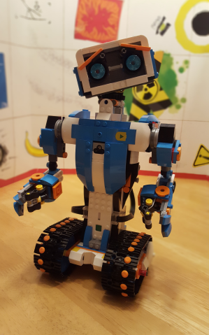

This repo is used to share my experiments with the LEGO® BOOST Creative Toolbox. All of them will be using the out-of-the-box programming language provided with the LEGO® BOOST app. I will use the Creative Canvas free-play mode.

 

*LEGO and BOOST are trademarks of LEGO®*.